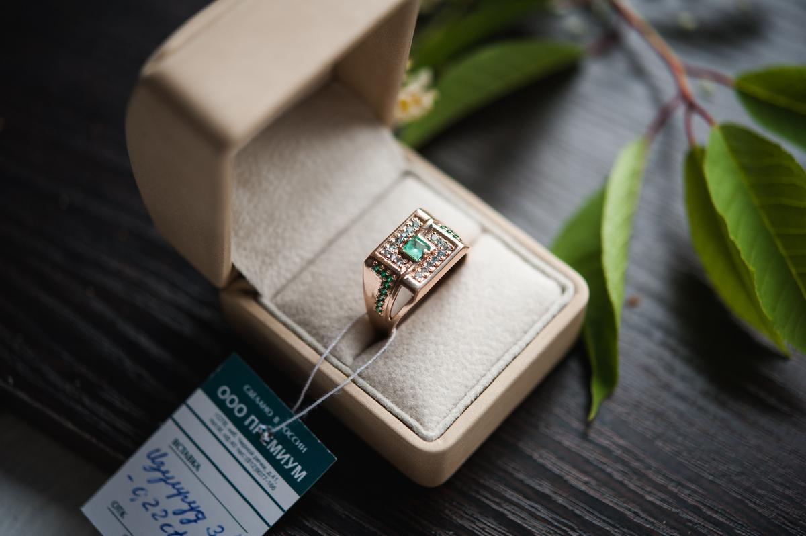

# 📋 ЮС 812 — Ювелирная студия

## 📁 Структура проекта

```
LandingAI/
├── index.html          # Главный файл лендинга
├── css/
│   └── style.css       # Все стили
├── js/
│   └── main.js         # JavaScript-функционал
├── assets/
│   └── images/         # Папка для фотографий (10-15 фото работ)
└── KODA.md             # Контекст проекта для AI-агента
```

## 🚀 Быстрый запуск

1. Откройте `index.html` в браузере
2. Готово! Сайт работает локально

## 📸 Добавление фотографий

1. Подготовьте 10-15 фотографий ваших работ (формат JPG/PNG)
2. Назовите файлы: `ring-1.jpg`, `ring-2.jpg`, `ring-3.jpg` и т.д.
3. Поместите в папку `assets/images/`
4. В `index.html` замените placeholder-ы на реальные фото:

```html
<!-- Было -->
<div class="service-card__placeholder">Печатки и перстни</div>

<!-- Стало -->

```

## 📊 Подключение Яндекс.Метрики

1. Откройте `index.html`
2. Найдите секцию `<!-- Яндекс.Метрика -->`
3. Замените `YOUR_COUNTER_ID` на ваш номер счетчика
4. Раскомментируйте код (уберите `<!-- -->`)

## 📧 Настройка формы заявок

Форма настроена на отображение модального окна "Заявка отправлена".

Для реальной отправки заявок на email `jewstudia812@yandex.ru`:
- Используйте сервис типа Formspree, Getform.io или аналогичный
- Или настройте PHP-обработчик на сервере

## 🎨 Настройка цветов

Все цвета в `css/style.css` в секции `:root`:
- `--color-gold` — основной золотой цвет
- `--color-black` — основной фон
- `--color-dark` — фон секций

## 📱 Тестирование

- Откройте в Chrome DevTools (F12)
- Переключитесь в режим мобильного устройства (Ctrl+Shift+M)
- Проверьте все секции и адаптивность

## 🌐 Публикация на хостинге

1. Заархивируйте все файлы (кроме `KODA.md`)
2. Загрузите на хостинг
3. Откройте домен (us812.ru) в браузере
4. Готово!

## 📞 Контакты

- Телефон: +7 (921) 907-71-66
- Email: jewstudia812@yandex.ru
- WhatsApp: +7 (921) 907-71-66
- Telegram: GoldMasterSPB
- Адрес: Санкт-Петербург, ул. Егорова 23БВ, 3 дверь, 1 этаж

## 🚀 Следующие шаги

1. [ ] Добавить фотографии работ
2. [ ] Подключить Яндекс.Метрику
3. [ ] Настроить отправку заявок на email
4. [ ] Протестировать на мобильных устройствах
5. [ ] Запустить Яндекс.Директ
6. [ ] Мониторить конверсии и оптимизировать